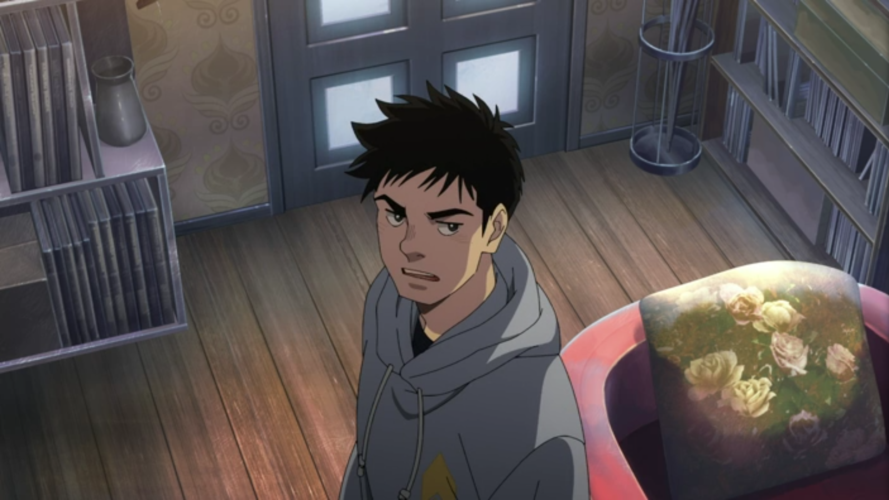
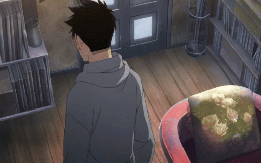
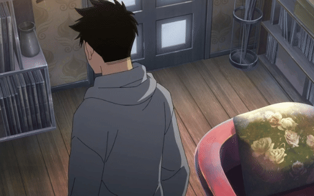

# GFI(Generative Frame Interpolation) Model specific to Anime domain

## Examples
### Input Images
|input frame1|input frame2|
|---|---|
|||
### Output Videos
|Runway|DynamiCrafter|ToonCrafter|
|---|---|--|
||||
